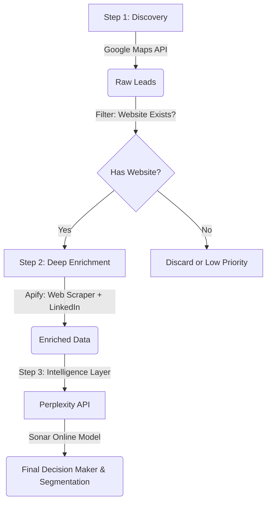

# Comprehensive Guide: Building an Advanced Multi-Stage Scraper
## For SDR & Insurance Niches (US Market)

This guide details exactly how to build a production-grade lead generation and enrichment pipeline. It combines three powerful APIs—**Google Maps (Discovery)**, **Apify (Deep Scraping)**, and **Perplexity (Intelligence)**—into a unified workflow.

This architecture is specifically optimized for:
*   **Outbound/SDR Agencies**: Looking for "B2B Lead Gen", "Appointment Setting", "Cold Email Agencies".
*   **Insurance Agencies**: Looking for "MGA", "Commercial Insurance", "Medicare Brokerages".

---

## 🏗️ Architecture Overview

The pipeline operates in a **Waterfall** method to maximize data quality and minimize cost.



---

## Step 1: Discovery Layer (Google Maps)
**Goal**: Find thousands of potential companies in specific US regions.
**Tool**: `Google Maps Platform (Places API New)`

### 1.1 The Strategy
Don't just search "Insurance". Be specific to find high-value targets. Use the `textSearch` method which allows strict filtering.

**Target Queries for SDR Agencies:**
*   "B2B Lead Generation Agency in Austin, TX"
*   "Outbound Sales Agency in San Francisco, CA"
*   "Appointment Setting Service New York"
*   "Cold Calling Call Center Florida"

**Target Queries for Insurance:**
*   "Commercial Insurance Brokerage Chicago"
*   "MGA Insurance Agency Texas"
*   "Medicare Field Marketing Organization (FMO) Florida"
*   "High Net Worth Insurance Broker California"

### 1.2 The Code (Python)
Use the `places.googleapis.com` endpoint. It is cheaper and more accurate than the old API.

```python
import requests

def search_google_maps(query, api_key):
    url = "https://places.googleapis.com/v1/places:searchText"
    headers = {
        'Content-Type': 'application/json',
        'X-Goog-Api-Key': api_key,
        # Critical: Only request fields you NEED to save money
        'X-Goog-FieldMask': 'places.displayName,places.websiteUri,places.formattedAddress,places.rating,places.userRatingCount,places.internationalPhoneNumber,places.types'
    }
    payload = {
        "textQuery": query,
        "maxResultCount": 20 # Max per page
    }
    
    # ... handle pagination with 'pageToken' ...
    return results
```

> [!TIP]
> **Filtering**: Immediately discard results that do not have a `websiteUri`. For SDR/B2B services, if they don't have a website, they are not a qualified lead (or they are out of business).

---

## Step 2: Deep Enrichment Layer (Apify)
**Goal**: Visit their website to confirm they are legit and find their LinkedIn page to gauge size.
**Tool**: `Apify Client` (running `apify/web-scraper` and `apify/linkedin-company-scraper`)

### 2.1 Web Scraping Logic
We don't just "scrape text". We use **Regex** to qualify them based on your niche.

**Custom Regex Config for this Scraper:**

| Niche | Regex Pattern to Search in HTML | What it tells us |
| :--- | :--- | :--- |
| **SDR Agency** | `appointment.setting|cold.call|outbound.sales` | Confirms they offer the service (vs just a marketing agency) |
| **SDR Agency** | `hubspot|salesforce|outreach.io` | Tech stack indicators (high value) |
| **Insurance** | `medicare|life.insurance|annuities` | Product focus |
| **Insurance** | `carrier|underwriting|mga` | Distinguishes meaningful agencies from solo agents |

### 2.2 The Code Integration
You will use `apify-client` to trigger a task.

```python
from apify_client import ApifyClient

client = ApifyClient("YOUR_TOKEN")

# Define the JavaScript Page Function that runs on the crawler
page_function = """
async function pageFunction(context) {
    const $ = context.jQuery;
    const html = $('body').html().toLowerCase();
    
    // SDR/Agency Indicators
    const is_hubspot = /hubspot/i.test(html);
    const does_cold_calling = /cold.call|outbound/i.test(html);
    
    // Insurance Indicators
    const is_medicare = /medicare|medigap/i.test(html);
    
    // Find LinkedIn URL to pass to next step
    const linkedin_url = $('a[href*="linkedin.com/company"]').attr('href');
    
    return {
        url: context.request.url,
        linkedin_url,
        is_hubspot,
        does_cold_calling,
        is_medicare
    };
}
"""

run_input = {
    "startUrls": [{"url": "http://example-agency.com"}],
    "pageFunction": page_function,
    "maxPagesPerCrawl": 5
}

# Run it
run = client.actor("apify/web-scraper").call(run_input=run_input)
```

### 2.3 LinkedIn Company Enrichment
If the Web Scraper finds a `linkedin_url`, feed it into `apify/linkedin-company-scraper`.
This gives you **Employee Count**.
*   **1-10 Employees**: Too small? Or perfect for a "start-up" offer?
*   **11-50 Employees**: Sweet spot for agencies.
*   **500+**: Enterprise.

---

## Step 3: Intelligence Layer (Perplexity)
**Goal**: The "Human Analyst" Simulator. Find the decision maker and categorize the business effectively.
**Tool**: `Perplexity API` (Model: `sonar` or `sonar-pro`)

### 3.1 Why Perplexity?
Scrapers fail to understand *context*.
*   A scraper sees "Insurance".
*   Perplexity understands "This is a *captive* Allstate agency, not an independent broker." (Big difference for sales).

### 3.2 The Prompt Engineering
This is the most critical part. You must pass the **Company Name** and **Website** to Perplexity.

```python
def query_perplexity_intelligence(company_name, website):
    url = "https://api.perplexity.ai/chat/completions"
    
    prompt = f"""
    Research the US-based company "{company_name}" ({website}).
    
    I am selling a service to {company_name}. I need to know 3 things:
    
    1. **Exact Niche**: Are they a Generalist Marketing Agency or a Specialized SDR/Outbound Shop? (Or for insurance: Captive vs Independent?)
    2. **Decision Maker**: Who is the Owner, CEO, or Founder? Return "Name - Title".
    3. **Contact Priority**: Rate them 1-10. 10 is a "Growth-focused independent agency". 1 is "Huge corporation" or "One-person freelancer".
    
    Return pure JSON: {{ "niche": "...", "dm": "...", "priority": 8 }}
    """
    
    # ... standard requests.post call ...
```

---

## 🚀 Putting It All Together (The Loop)

1.  **Run `generate_leads_places.py`**:
    *   Input: List of 50 Cities x 5 Niches.
    *   Output: `raw_leads.csv` (Target: 1,000 leads).
2.  **Filter**: Remove duplicates and rows without websites.
3.  **Run `enrich_apify.py`**:
    *   Input: `raw_leads.csv`.
    *   Action: Scrapes all websites in parallel. Finds LinkedIn URLs.
4.  **Run `enrich_perplexity.py`**:
    *   Input: The high-potential leads from Step 3 (e.g., verified website + correct keywords).
    *   Action: Finds the CEO name and email format guess.
5.  **Final Output**: A `master_leads.csv` ready for your cold email tool (Smartlead/Instantly).
