# Architecture Decision Document

_This document builds collaboratively through step-by-step discovery. Sections are appended as we work through each architectural decision together._

## Project Context Analysis

### Requirements Overview

**Functional Requirements:**
The system requires a robust **Async Job Engine** to handle three distinct workloads:
1.  **Short-lived/Interactive**: LinkedIn Carousel generation (TypeScript Edge Functions).
2.  **Stateful/Multi-stage**: Blog generation (Research -> Strategy -> Write) requiring state persistence.
3.  **Long-running/Batch**: Lead Enrichment (Python Scripts) processing hundreds of records.

**Non-Functional Requirements:**
*   **Latency**: Enqueue <500ms.
*   **Reliability**: Zero timeouts (requires strictly decoupled workers).
*   **Safety**: Cost guardrails and "Draft-Only" enforcement.

**Scale & Complexity:**
*   **Primary Domain**: Backend-Heavy Internal Tooling (Web + Worker).
*   **Complexity Level**: **Medium-High** (due to Hybrid Runtime orchestration).
*   **Estimated Components**: 4-5 (Job Manager, Content Service(TS), Leads Worker(Python), Realtime Service).

### Technical Constraints & Dependencies

1.  **Hybrid Runtimes**: We must orchestrate both **TypeScript Edge Functions** (Supabase native) and **Python Scripts** (legacy/external). This implies a need for a unified "Job Interface" that abstracts the underlying runtime.
2.  **Stateful AI Workflows**: The Blog Generator is a Finite State Machine. If it fails at step 3, it should resume from step 3. The architecture must support **Resumable Jobs** via checkpointing.
3.  **Strict Async**: All AI operations must be backgrounded to avoid browser timeouts.

### Cross-Cutting Concerns Identified (Consensus)

1.  **Identity Management**: Python automation scripts running outside the Edge environment need specific Role/Auth scopes, not just root access. Use of RLS is critical.
2.  **Checkpointing Pattern**: The `jobs` table requires a `checkpoint_data` JSON structure to store intermediate state for multi-stage jobs.
3.  **Data Reversibility**: AI-driven updates (especially on Leads) should be non-destructive or versioned (Audit Log) to allow rollback of hallucinations/errors.

**4. Future Scalability (Phase 2: Inbox/Outreach):**
*   **Requirement**: The next sprint will introduce **Two-Way Sync** (Incoming Messages via Unipile Webhooks).
*   **Architectural Impact**: The `worker-dispatcher` must be designed to handle not just "User Initiatives" (Outgoing) but also "Webhook Events" (Incoming).
*   **Decision**: We will provision the `jobs` table to support `type: 'incoming_webhook'` to allow using the same Async Engine for processing inbound LinkedIn messages later.

### Cross-Cutting Research Integration (Google Cloud Agents)
*   **Hybrid Runtime**: We will adopt a **Hybrid Microservices** architecture.
    *   **Frontend**: Next.js (Supabase Auth/UI).
    *   **AI Backend**: Python FastAPI on **Cloud Run** (for access to advanced RAG/Deep Research tools).
*   **State Management**: **Supabase-First**. We will store LangChain history in Supabase (Postgres) to keep a "Single Source of Truth", avoiding a split-brain with Firestore.
*   **Deployment**: **Cloud Run** over Vertex AI Endpoints (Scale-to-Zero cost efficiency).

## Architecture Decision: Separated Workflow Systems (Step 3)

### The Challenge
The initial PRD mentioned two distinct workflow types that should NOT be mixed:

1. **Content Generation** (Carousels, Blogs): Fast, interactive, already working
2. **LinkedIn Outreach**: Slow, safety-critical, requires human simulation

Attempting to use a unified async job engine would create unnecessary complexity and risk degrading the performance of the working carousel system.

### The Solution: Complete Separation

We will implement **two independent systems**, each optimized for its specific purpose:

#### System 1: Content Generation (Hybrid Microservice Model)

**Scope:** LinkedIn Carousels, Blog Posts, Deep Research
**Current State:** Carousel generation working via Edge Functions. Blog/Research requiring Python migration.

**Architecture:**
- **Hybrid Runtime Split:**
    - **Simple/Fast (Carousels):** Direct Edge Function Invocation (Keep As-Is).
    - **Complex/Slow (Deep Research):** Python FastAPI Service on **Google Cloud Run**.
- **Async Job Pattern:**
    - UI creates `job` row in Supabase.
    - **Database Webhook** triggers Cloud Run Python Service.
    - Service executes LangChain Workflow -> Updates `job` row with result.
- **State Management:**
    - All conversation history stored in Supabase `chat_history` table.
- **Optional Audit Trail:** Add `content_history` table for analytics (non-blocking)
- **Realtime Updates:** Use Supabase Realtime for progress notifications

**Why Hybrid:**
- **Edge Functions**: Great for simple logic, but poor for long-running AI agents or heavy Python libraries.
- **Cloud Run (Python)**: Essential for "Deep Research" agents using Google ADK and complex LangGraphs. Scales to zero (cheap).

#### System 2: LinkedIn Automation (Future Phase)

**Scope:** Outreach sequences, Connection requests, Message sending
**Current State:** Not yet built (Phase 2)

**Architecture:**
- **Dedicated `linkedin_automation` Table:**
  - Separate from content generation
  - Includes `scheduled_for`, `jitter_delay`, governance fields
- **Governor System:**
  - pg_cron scheduler (every 10 min)
  - Safety checks: time windows (9am-9pm), daily limits, rate limiting
- **Human Simulation:**
  - Random delays (20-40min between actions)
  - Account safety as top priority

**Why Separate:**
- Different risk profiles (low vs high)
- Different latency requirements (fast vs slow)
- Different safety needs (none vs strict)
- Prevents accidental cross-contamination

### Decision Rationale

| Aspect | Content Generation | LinkedIn Automation |
|:-------|:------------------|:-------------------|
| **Latency** | <500ms (fast) | Hours (human-like) |
| **Risk** | Low (internal APIs) | High (account ban risk) |
| **Implementation** | Already working | Future phase |
| **Safety Checks** | None needed | Critical requirement |
| **Architecture** | Direct function calls | Governed job queue |

## Component Architecture: Content Generation System (Step 4)

### 1. Current Implementation (Keep As-Is)

**Edge Function:** `supabase/functions/generate-linkedin-carousel/index.ts`
- Frontend calls function directly
- No job queue needed
- Returns result immediately (or streams realtime updates)

### 2. Optional Enhancement: Content History Table

For analytics and audit trail (non-critical):

```sql
create table public.content_history (
  id uuid primary key default gen_random_uuid(),
  content_type text not null, -- 'carousel', 'blog', 'research'
  status text not null, -- 'processing', 'completed', 'failed'
  prompt text,
  result jsonb,
  created_at timestamptz default now(),
  completed_at timestamptz,
  user_id uuid references auth.users(id)
);
```

**Usage:** Insert on start, update on completion. Frontend subscribes to changes for progress updates.

### 3. Realtime Integration (Current Pattern)

```typescript
// Frontend subscribes
const channel = supabase
  .channel('content-updates')
  .on('postgres_changes', {
    event: 'UPDATE',
    schema: 'public',
    table: 'content_history',
    filter: `user_id=eq.${userId}`
  }, (payload) => {
    // Update UI with progress
  })
  .subscribe();
```

## Component Architecture: LinkedIn Automation System (Step 5 - Future)

**Note:** This system is NOT part of Phase 1. Documented here for future reference.

### 1. Data Schema

```sql
create table public.linkedin_automation (
  id uuid primary key default gen_random_uuid(),
  action_type text not null, -- 'send_invite', 'send_message', 'view_profile'
  status text not null default 'scheduled', -- scheduled, executing, completed, failed
  payload jsonb not null,
  
  -- Human Simulation
  scheduled_for timestamptz not null, -- When to execute (includes jitter)
  jitter_applied_minutes int, -- Track randomization for debugging
  
  -- Safety & Governance
  daily_limit_check boolean default false,
  time_window_check boolean default false,
  
  -- Execution
  executed_at timestamptz,
  result jsonb,
  error text,
  
  -- Audit
  created_at timestamptz default now(),
  user_id uuid references auth.users(id) not null
);

-- Safety configuration
create table public.automation_rules (
  rule_key text primary key, -- 'daily_invite_limit'
  config jsonb not null, -- { "min": 20, "max": 40, "window_start": "09:00", "window_end": "21:00" }
  current_usage int default 0,
  last_reset_at timestamptz default now()
);
```

### 2. Governor Implementation (pg_cron)

```sql
-- Scheduled function (runs every 10 min)
create or replace function process_linkedin_queue()
returns void as $$
declare
  current_hour int;
  daily_limit int;
  actions_today int;
begin
  -- Safety Check 1: Time Window
  current_hour := extract(hour from now());
  if current_hour < 9 or current_hour >= 21 then
    return; -- Outside safe hours
  end if;
  
  -- Safety Check 2: Daily Limit
  select current_usage into actions_today
  from automation_rules
  where rule_key = 'daily_invite_limit';
  
  select (config->>'max')::int into daily_limit
  from automation_rules
  where rule_key = 'daily_invite_limit';
  
  if actions_today >= daily_limit then
    return; -- Hit limit for today
  end if;
  
  -- Process eligible jobs
  -- (Implementation details for Phase 2)
end;
$$ language plpgsql;
```

## Integration Architecture (Step 6)

### Phase 1: Content Generation Only

**Frontend → Edge Function**
1. User clicks "Generate Carousel"
2. Frontend calls `supabase.functions.invoke('generate-linkedin-carousel', { prompt })`
3. Edge function processes immediately
4. Returns result or updates via Realtime
5. Optional: Insert record in `content_history` for analytics

**No job queue, no delays, no complexity.**

### Phase 2: Add LinkedIn Automation (Future)

When building the outreach system:
1. Completely separate codebase from content generation
2. Independent admin dashboard
3. Separate database tables
4. Different safety model

## Visual Architecture Diagrams

### Interactive Architecture Diagram (Excalidraw)

For an interactive, editable view of the separated architecture, see:

**[Lifetrek Separated Architecture](file:///Users/rafaelalmeida/Lifetrek-App/_bmad-output/planning-artifacts/diagrams/lifetrek-separated-architecture.excalidraw)**

This diagram shows:
- Phase 1 (Green): Content Generation System - Fast, simple, direct Edge Function calls
- Phase 2 (Orange): LinkedIn Automation System - Slow, governed, safety-critical with Governor

Open in [Excalidraw](https://excalidraw.com) to edit or customize.

---

### System Overview: Separated Architecture


### Content Generation Workflow (Phase 1)


### LinkedIn Automation Workflow (Phase 2 - Future)


### Data Flow: Separated Systems


### Decision Matrix: Why Separate?

```mermaid
graph TD
    START{Workflow Type?}
    
    START -->|Content<br/>Generation| CG[Content Generation<br/>System]
    START -->|LinkedIn<br/>Automation| LA[LinkedIn Automation<br/>System]
    
    CG --> CG1[Direct Edge Function]
    CG --> CG2[No Queue]
    CG --> CG3[< 500ms latency]
    CG --> CG4[Low Risk]
    CG --> CG5[Already Working]
    
    LA --> LA1[Dedicated Queue]
    LA --> LA2[Governor + pg_cron]
    LA --> LA3[Hours latency]
    LA --> LA4[High Risk]
    LA --> LA5[Phase 2 - Future]
    
    CG5 --> RESULT1[✓ Keep Simple]
    LA5 --> RESULT2[⚠️ Safety Critical]
    
    style START fill:#2196F3,stroke:#0D47A1,color:#fff
    style CG fill:#4CAF50,stroke:#2E7D32,color:#fff
    style LA fill:#FF9800,stroke:#E65100,color:#fff
    style RESULT1 fill:#81C784,stroke:#2E7D32
    style RESULT2 fill:#FFB74D,stroke:#E65100
```



### Hybrid System Overview (New)

```mermaid
graph TB
    subgraph "Frontend Layer (Next.js)"
        UI[User Interface]
        AUTH[Supabase Auth]
        UI --> AUTH
    end

    subgraph "Data Layer (Supabase)"
        DB[(Postgres)]
        VEC[(pgvector)]
        REAL[Realtime]
        STO[Storage]
        
        DB <--> VEC
        DB --> REAL
    end

    subgraph "Compute Layer (Hybrid)"
        EDGE[Edge Functions<br/>(TypeScript)]
        RUN[Cloud Run Service<br/>(Python Agent)]
        
        EDGE -->|Fast| DB
        RUN -->|Deep| DB
        RUN -->|RAG| VEC
    end
    
    UI -->|Invoke| EDGE
    UI -->|Insert Job| DB
    DB -->|Webhook| RUN
    
    style RUN fill:#FF9800,stroke:#E65100,color:#fff
```

### Implementation Readiness

### Phase 1 Scope (Current)
- ✅ Architecture defined for content generation (Hybrid Model)
- ✅ Carousel generation working (Edge Function)
- 📋 **To Build**: Python Cloud Run Service for "Deep Research" & Blog Agents
- 📋 **To Build**: Async Job Queue (Webhooks)
- ⏭️ Optional: Add `content_history` table for analytics

### Phase 2 Scope (Future)
- 📋 LinkedIn automation system (separate architecture review needed)
- 📋 Governor implementation
- 📋 Safety guardrails
- 📋 Human simulation logic

### Next Steps
1. Mark Architecture as **completed**
2. Proceed to **Create Epics & Stories**
3. Focus Phase 1 epics on content generation features
4. Defer LinkedIn automation to Phase 2

