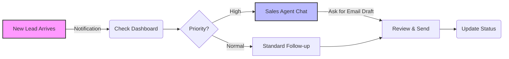
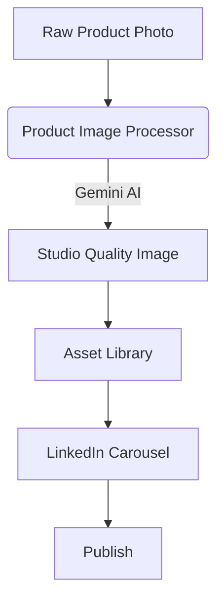

# 📘 Lifetrek Platform Guide

> [!IMPORTANT]
> **Essential URL**: Access your [Sales Dashboard](/admin) to start managing leads.

Welcome to the **Lifetrek Medical** intelligent platform. This guide is designed to get you from "zero to hero" in minutes. We've organized everything by **Role** so you only see what you need.

---

## 🚀 Quick Start Flows

### For Sales Engineers: The Daily Loop

### For Admins: Content Creation Loop

---

## 👷‍♂️ Sales Engineer Guide

Your command center is the **Dashboard EV**. Here is how to master it.

### 1. analyzing a Lead
Don't just read—**analyze**. The dashboard gives you superpowers:
-   **⭐ AI Score (1-5)**: Trust this. A '5' means they match our ideal customer profile (Medical OEM + High Volume).
-   **🚨 Priority Badges**:
    -   **High (Red)**: Drop everything. This lead is hot.
    -   **Medium (Yellow)**: Follow up within 4 hours.
    -   **Low (Green)**: Nurture track.

### 2. Utilizing the Sales Agent (AI) 🤖
Stop staring at a blank screen. The **"Assistente IA"** tab is your pair programmer for sales.

> [!TIP]
> **Prompt like a Pro**: Be specific about the output you want.

| Goal | Try saying this... |
| :--- | :--- |
| **Drafting an Email** | *"Draft a reply to Dr. Silva regarding the Titanium Screw RFQ. Emphasize our ISO 13485 certification and 5-axis capabilities in Portuguese."* |
| **Technical Check** | *"What are the max dimensions for our Citizen Swiss-type lathe?"* |
| **Objecion Handling** | *"The client says our lead time is too long. Give me 3 bullet points on why our quality assurance process is worth the wait."* |

---

## 🎨 Admin & Marketing Guide

Create agency-quality assets without the agency using our Generative AI tools.

### 1. Studio-Quality Product Photos 📸
Turn a quick phone snap into a catalog image.

1.  Navigate to **Product Image Processor**.
2.  **Drag & Drop** your raw image.
3.  Watch `Gemini 3 Pro` work its magic:
    *   ✨ Removes messy backgrounds
    *   💡 Adds professional lighting
    *   🏷️ Auto-tags (e.g., "Orthopedic", "Steel")
4.  **Save** to Library.

> [!WARNING]
> Ensure the raw photo is in focus. AI can fix lighting, but it can't fix a blurry source image!

### 2. Instant LinkedIn Carousels 📱
Position Lifetrek as a thought leader.

1.  Open **LinkedIn Carousel Generator**.
2.  **Input Topic**: *e.g., "Why Surface Finish Matters in Medical Implants"*
3.  **Set Audience**: *e.g., "Medical Device Engineers"*
4.  **Generate**: The system builds the narrative and visuals for you.
5.  **Export**: Download as PDF/PNG and post directly.

### 3. Pitch Decks 📊
Need a presentation for a big meeting?
-   Go to **Pitch Deck** generator.
-   Select the modules you need (Company History, Certifications, Capabilities).
-   The tool assembles a brand-compliant deck instantly. **No more formatting nightmares.**

---

## ⚙️ Advanced Settings

Access the `/admin` panel for deep system configuration:
-   **User Access**: Invite new team members.
-   **Enrichment Rules**: Configure how we scrape and score data.
-   **Logs**: Audit system activity.

---

> [!NOTE]
> **Need Help?**
> If you encounter a bug or need a feature, please contact the development team via the internal Slack channel.
